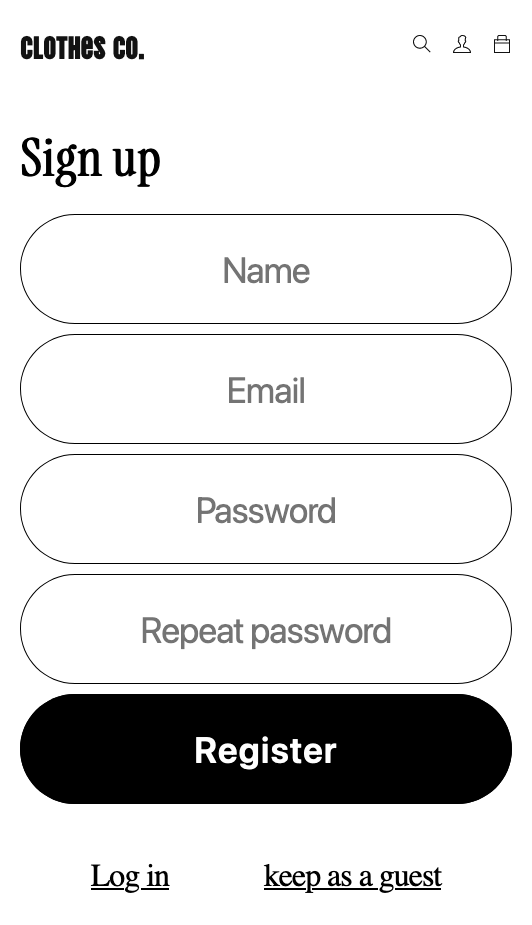

<h1 align="center">
Clothes co.
</h1>
<h4 align="center">
Uma marca que busca inspirar e impulsionar a cultura criativa à frente.
</h4>
<div align="center" >
<div align="center" style="max-width: 1050px">
Encaramos nosso trabalho com a mentalidade de que cada produto é uma experiência de aprendizado para aprimorar nossa técnica. Somos praticantes e divulgadores da cultura criativa e nos inspiramos em suas diversas formas, como arte, design, moda, música e cinema.
</div>
</div>
<br>
<br>

[](https://clothco.vercel.app/)
<br>

<div align="center">

**[[Acesse o aplicativo online]](https://clothco.vercel.app/)**

</div>
<br>

**Clothes co.** é um e-commerce feito com **back-end** operando com **Node.js** e **Express** conectado ao **MongoDB** como banco de dados. O **front-end** foi desenvolvido usando apenas **React.js** e **Styled Components**.

O carrinho de compras persiste os dados no **localStorage** do navegador _enquanto o usuário não está logado_. Quando o usuário faz login, _os dados são salvos no banco de dados na conta do usuário_.

Para realizar o pagamento no checkout, é _necessário o cadastro do usuário na plataforma_. Então, o **back-end** valida os dados da compra, _checa se o banco de dados tem estoque suficiente para realizar a compra_ e, então, realiza a compra, _salvando os dados da compra no banco de dados e atualizando o estoque_.

Ao finalizar a compra e a ordem de compra é solicitada, o banco de dados retorna os dados do processo da compra com todos os itens comprados, o valor de cada item e o total, junto com o número identificador da transação.
<br>

### Principais recursos

- **Branding**: O e-commerce possui um estilo moderno e jovem, em um layout simples, responsivo e intuitivo. O objetivo é criar um site confiavel, além de uma experiência de compra agradável para os usuários.
- **Página inicial**: A página inicial apresenta os produtos em destaque por fotos. A página também apresenta a marca e sua história
- **Página detalhada dos produtos**: A página de produto apresenta informações detalhadas sobre o produto, incluindo valor, quantidade, tipo, cor, fotos e descrição. É possível finalizar a compra ou adicionar ao carrinho.
- **Carrinho de compras**: O carrinho de compras mantém as escolhas do usuário mesmo que ele saia da página. Ele também mostra a disponibilidade em estoque de cada produto, evitando que o usuário faça um pedido de um produto que não esteja disponível. Além de permitir alterar o pedido ou remover produtos do carrinho.
- **Checkout seguro**: O pagamento é realizado por meio de um gateway de pagamento seguro. Aqui é necessário o cadastro do usuário no site para emitir nota fiscal e finalizar o pagamento.
- **Nota fiscal com dados da transação**: O usuário recebe uma nota fiscal com os dados da transação da compra. A nota fiscal inclui o valor total da compra, os produtos adquiridos e a data da compra.
- **Banco de dados com cryptografia**: O banco de dados é desenvolvido com princípios de TDD, conferindo confiabilidade ao código. Os dados são validados antes de serem processados e todos os dados sensíveis são criptografados antes de serem salvos.
<br>

### Como ter acesso:

1. **Acesse** nosso site: **[Clothes co.](https://clothco.vercel.app/)**
<br>

### Como usar:

1. Escolha os produtos que deseja comprar e **adicione ao carrinho**.
2. **Crie uma conta ou faça login** com uma conta já existente.
3. **Finalize a compra** e receba a nota fiscal com os dados da transação.
<br>

<div style="display: flex; flex-wrap: wrap;">





</div>
<br>

### Tecnologias usadas

**Front-end** _(interface)_**:**
- **[React](https://react.dev/)**
- **[Styled-components](https://styled-components.com/)**
- **[React-icons](https://react-icons.github.io/react-icons)**

**Back-end** _(servidor)_**:**
- **[Node.js](https://nodejs.org/en)**
- **[Express](https://expressjs.com/)**
- **[MongoDB](https://www.mongodb.com/)**
- **[Mongoose](https://mongoosejs.com/)**
- **[JWT](https://jwt.io/)**
- **[Joi](https://joi.dev/)**
- **[Bcrypt](https://www.npmjs.com/package/bcrypt)**
- **[Http-status-codes](https://www.npmjs.com/package/http-status-codes)**
- **[Render](https://render.com/)**
<br>

## Como rodar o projeto

**_Para rodar o projeto ambos Front-end e Back-end devem estar rodando._**

### **Como rodar o back-end**

1. Clone o repositório do back-end:
    ```bash
    git clone https://github.com/Yokuny/ClothCo-BackEnd
    ```

2. Instale as dependências:
    ```bash
    npm install
    ```

3. Crie o arquivo .env na raiz do projeto e insira as seguintes linhas:
    ```bash
    #database connection
    DATABASE_URL=mongodb+srv://x:x@cluster.x.mongodb.net

    #server port access used by the front-end
    PORT=8080
    ```

4. Rode o projeto em modo de desenvolvimento:
    ```bash
    # development
    npm run dev

    # watch mode
    npm run start
    ```

### **Como rodar o front-end**

1. Clone o repositório do projeto:
    ```bash
    git clone https://github.com/Yokuny/ClothCo
    ```

2. Instale as dependências:
    ```bash
    npm install
    ```

3. Crie o arquivo .env na raiz do projeto e insira a seguinte linha:
    ```bash
    #The same url as the back-end
    REACT_APP_API_URL=http://localhost:8080/
    ```

4. Rode o projeto em modo de desenvolvimento:
    ```bash
    npm run start
    ```

5. Acesse o projeto em:
    ```bash
    http://localhost:3000/
    ```

6. Para gerar uma build do projeto:
    ```bash
    npm run build
    ```
<br>